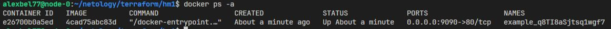

# Домашнее задание к занятию «Введение в Terraform»

## Задание 1

<center>

</center>

2. Согласно приведенному .gitignore секреты допустимо хранить в `personal.auto.tfvars`.

3. Секретное содержимое созданного ресурса **random_password**:

    ```json
    "result": "q8TI8aSjtsq1wgf7"
    ```

4. В строке 24 ошибка вызвана недостающим именем ресурса. Все блоки ресурсов должны иметь 2 метки тип и имя.

    В строке 29 ошибка вызвана неверным именем ресурса. Имя должно начинаться с буквы или символа подчеркивания и может содержать только буквы, цифры, символы подчеркивания и тире.

    В строке 31 также используется неверное имя ресурса ресурс `"random_password" "random_string_FAKE"`, который не объявлен и неподдерживаемый атрибут `resulT`.

5. Исправленный франмент кода:

    ```bash
    resource "docker_image" "nginx"{
    name         = "nginx:latest"
    keep_locally = true
    }

    resource "docker_container" "nginx" {
    image = docker_image.nginx.image_id
    name  = "example_${random_password.random_string.result}"

    ports {
        internal = 80
        external = 9090
    }
    }
    ```
    <center>
    
    </center>

6. Ключ `auto-approve` пропускает интерактивное утверждения плана перед применением. Может быть полезным для автоматизации процесов развертывания инфраструктуры и везде, где нет возможности интерактива.

    <center>
    
    </center> 

7. Созданные ресурсы были уничтожены командой `terraform destroy`. Содержимое файла **terraform.tfstate**:

    ```json
    {
    "version": 4,
    "terraform_version": "1.11.3",
    "serial": 17,
    "lineage": "32efb13d-c1a0-7d6f-ef2f-03a9b41bbda2",
    "outputs": {},
    "resources": [],
    "check_results": null
    }
    ```

8. Образ **nginx:latest** не был удален из-за использования в блоке `resource "docker_image" "nginx"{}` аргумента `keep_locally` со значением `true`.
    - `keep_locally` (boolean) Если `true`, то образ Docker не будет удален при операции уничтожения. Если равно `false`, образ будет удален из локального хранилища docker при операции уничтожения.

## Задание 2*

Итоговый код **задания 2** в файле [main.tf](https://github.com/alex-bel31/ter_homeworks/blob/main/ter-01-intro/main.tf)


