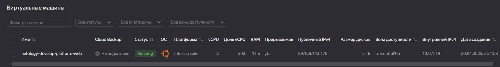
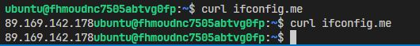
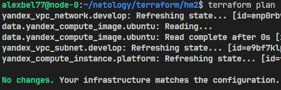
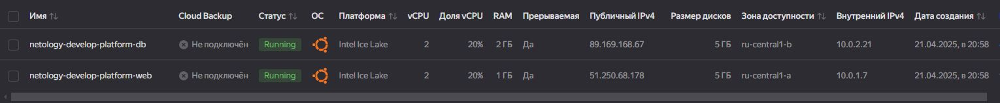
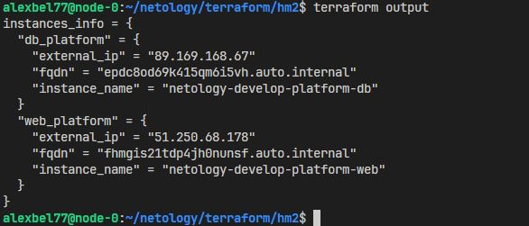
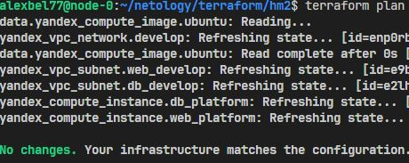
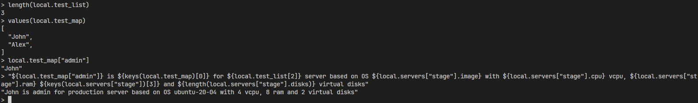
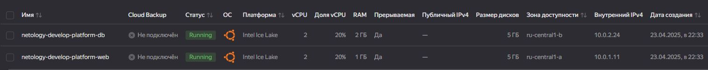
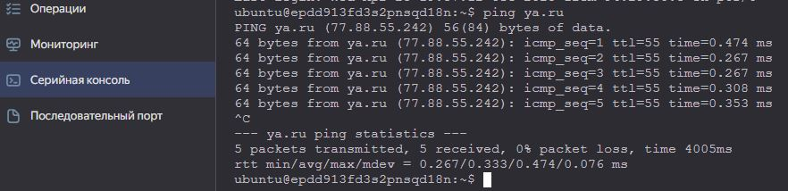

# Домашнее задание к занятию «Основы Terraform. Yandex Cloud»

## Задание 1

Ошибка заключается в значении атрибута `platform_id`. Платформы **standart-v4** не существует.

Также указана недопустимая гарантированная доля vCPU на платформе **standard-v3**, допустимые фракции ядра: 20, 50, 100.
  
Указано количество ядер недоступно на платформе **standard-v3**, допустимое количество ядер: 2 до 96

Параметры `preemptible = true` и `core_fraction=5` полезные в процессе обучения, так как это сильно дешевле обычных ВМ.

<center>
  
</center>

<center>
  
</center>

## Задание 2 

Заменены все хардкод-значения для ресурсов `yandex_compute_image` и `yandex_compute_instance` на отдельные переменные:

```hcl
data "yandex_compute_image" "ubuntu" {
  family = var.vm_web_image_family
}
resource "yandex_compute_instance" "platform" {
  name        = var.vm_web_name
  platform_id = var.vm_web_platform_id
  resources {
    cores         = var.vm_web_cores
    memory        = var.vm_web_memory
    core_fraction = var.vm_web_core_fraction
  }
```

<center>
  
</center>

## Задание 3 

Перменные относящиеся к ВМ были вынесены в файл **vms_platform.tf**.
Созданы две виртуальные машины работающих в разных зонах:

- `web_platform` с параметрами из переменных **vm_web_***
- `db_platform` с параметрами из **vm_db_***

<center>
  
</center>

## Задание 4 

Был создан блок `output "instances_info"` содержащий: **instance_name, external_ip, fqdn** для каждой из ВМ.

Тип данных для `instances_info` - **map(map())**, где каждый элемент описывает ВМ и её атрибуты.

<center>
  
</center>

## Задание 5

В блоке `locals` создал локальные переменные **vm_web_name** и **vm_db_name** с использованием интерполяции значений из списка переменной **var.vm_name**.

```hcl
locals {
  vm_web_name = "netology-develop-platform-${var.vm_name[0]}"
  vm_db_name  = "netology-develop-platform-${var.vm_name[1]}"
}
```

## Задание 6

Задаем перменную `vms_resources`, которая представляет собой **map(object)**, где ключами являются имена виртуальных машин, а значениями объекты с параметрами конфигурации ВМ.

```hcl
variable "vms_resources" {
  type = map(object({
    cores         = number
    memory        = number
    core_fraction = number
  }))
  default = {
    vm_web = {
      cores         = 2
      memory        = 1
      core_fraction = 20
    }
    vm_db = {
      cores         = 2
      memory        = 2
      core_fraction = 20
    }
  }
  description = "Defines resource configuration for VM"
}
```

Задаем переменную `vms_metadata` типа **map(string)** с двумя ключами: **"serial-port-enable"** и **"ssh-keys"**:

```hcl
variable "vms_metadata" {
  type = map(string)
  default = {
    "serial-port-enable" = "1"
    "ssh-keys"           = "ubuntu:ssh-ed25519 xxxxxxx"
  }
  sensitive = true
}
```

<center>
  
</center>

## Задание 7*

<center>
  
</center>

## Задание 8

Тип переменной был задан, как `list(map(list(string)))`

Выражение в **terraform console**, которое позволит вычленить строку **"ssh -o 'StrictHostKeyChecking=no' ubuntu@62.84.124.117"** выглядит следующим образом:

```hcl
var.test[0].dev1[0]
```

## Задание 9

Предварительно было выполнено подключение к виртуальным машинам через **ssh**, и задан пароль пользователю **ubuntu**

В раннее созданные русурсы для подсетей была добавлена строка c указанием на таблицу маршрутизации:

```hcl
route_table_id = yandex_vpc_route_table.rt.id
```

Был создан ресурс `"yandex_vpc_gateway" "nat_gateway"` c параметром `shared_egress_gateway {}`

Создана таблица маршрутизации `yandex_vpc_route_table.rt`, в которую добавлен маршрут:

```hcl
static_route {
  destination_prefix = "0.0.0.0/0"
  gateway_id         = yandex_vpc_gateway.nat_gateway.id
}
```

В блоках ресурсов для создания ВМ изменено значение аргумента `nat` на **false**:

<center>
  
</center>

<center>
  
</center>