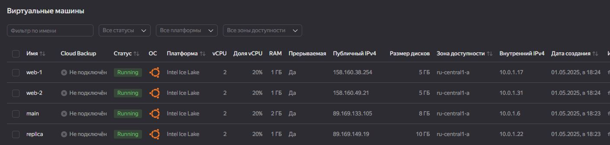
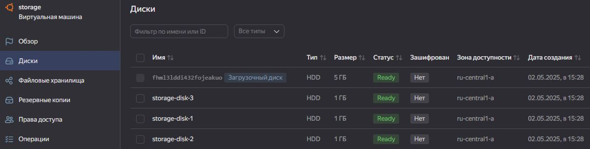
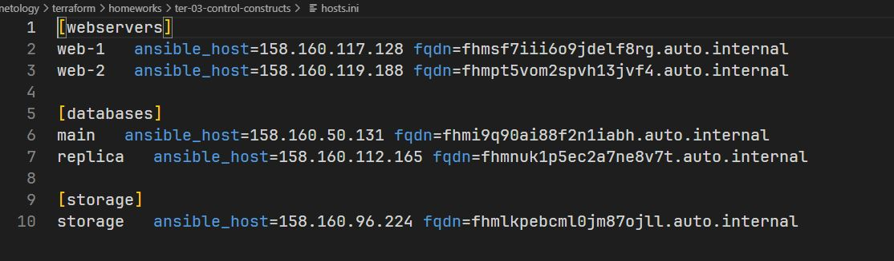

# Домашнее задание к занятию «Управляющие конструкции в коде Terraform»

## Задание 1

<center>
  
</center>

*скриншот входящих правил «Группы безопасности» в ЛК Yandex Cloud .*

## Задание 2

В файле [count-vm.tf]() был создан ресурс для создания двух одинаковых ВМ с использованием мета-аргумента **count loop**. Имена ВМ были заданы следующим образом:

```hcl
  count       = 2
  name        = "web-${count.index + 1}"
```

Также ВМ была назначена ранне созданная группа безопасности:

```hcl
  network_interface {
    subnet_id          = yandex_vpc_subnet.develop.id
    security_group_ids = [yandex_vpc_security_group.example.id]
  }
```
В файле [for_each-vm.tf]() был создан ресурс для создания двух ВМ разных по cpu/ram/disk_volume с использованием мета-аргумента **for_each loop**.
Была задана переменная ``type = list(object()`` для параметров ВМ.

Так как **for_each** принимает в качестве указателя количества экземпляров только **set** или **map**, было выполнено преобразоване списка в **map** с помощью `locals.vm_map`:

```hcl
locals {
  vm_map = { for vm in var.each_vm : vm.vm_name => vm }
}
```
<center>
  
</center>

## Задание 3

С помощью `resource "yandex_compute_disk" "disks" {}` и и мета-аргумента **count** в файле [disk_vm.tf]() было создано 3 одинаковых диска:

```hcl
resource "yandex_compute_disk" "disks" {
  count = 3
  name     = "${var.disks.storage.name}-${count.index+1}"
  type     = var.disks.storage.type
  zone     = var.default_zone
  size = var.disks.storage.size
}
```

В этом же файле создана одиночная ВМ **storage** к которой подключены раннее созаднные диски с использованием блока `dynamic "secondary_disk" {}`,  мета-аргумента **for_each** и аргумента **auto_delete = true** для автоматического удаления при удалении экземпляра:

```hcl
dynamic "secondary_disk" {
  for_each = yandex_compute_disk.disks

  content {
    disk_id = secondary_disk.value.id
    auto_delete = true
  }
}
```
<center>
  
</center>

## Задание 4

В файле [ansible.tf]() создана локальная перменная, которая содержит информациб о трех группах ресурсов ВМ:

```hcl
locals {
    web = yandex_compute_instance.count_vm
    db = values(yandex_compute_instance.for_each_vm)
    storage = [yandex_compute_instance.storage]
}
```
Ресурс `"local_file" "ansible_inventory"` создает файл с инвентарем, используя шаблон [hosts.tftpl](), который итерируется по **web, db** и **storage** группам подставляя данные о ВМ. И записывает в файл **hosts.ini**.

<center>
  
</center>

## Задание 5*
