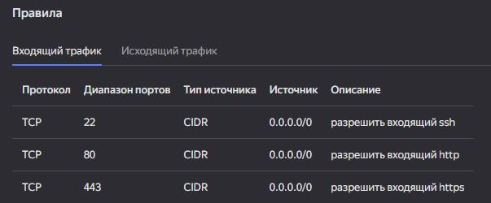

# Домашнее задание к занятию «Управляющие конструкции в коде Terraform»

## Задание 1

*скриншот входящих правил «Группы безопасности» в ЛК Yandex Cloud .*

<center>
  
</center>

## Задание 2

В файле [count-vm.tf]() был создан ресурс для создания двух одинаковых ВМ с использованием мета-аргумента **count loop**. Имена ВМ были заданы следующим образом:

```hcl
  count       = 2
  name        = "web-${count.index + 1}"
```

Также ВМ была назначена ранне созданная группа безопасности:

```hcl
  network_interface {
    subnet_id          = yandex_vpc_subnet.develop.id
    security_group_ids = [yandex_vpc_security_group.example.id]
  }
```
В файле [for_each-vm.tf]() был создан ресурс для создания двух ВМ разных по cpu/ram/disk_volume с использованием мета-аргумента **for_each loop**.
Была задана переменная ``type = list(object()`` для параметров ВМ.

Так как **for_each** принимает в качестве указателя количества экземпляров только **set** или **map**, было выполнено преобразоване списка в **map** с помощью `locals.vm_map`:

```hcl
locals {
  vm_map = { for vm in var.each_vm : vm.vm_name => vm }
}
```
## Задание 3


