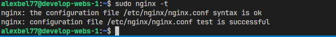
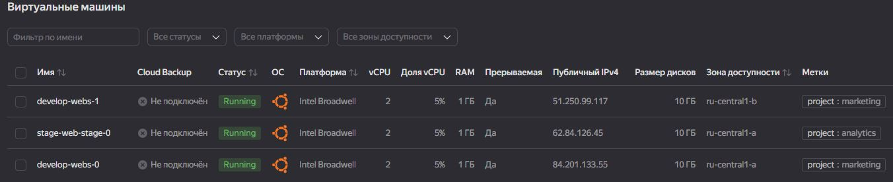
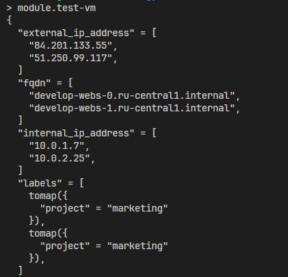
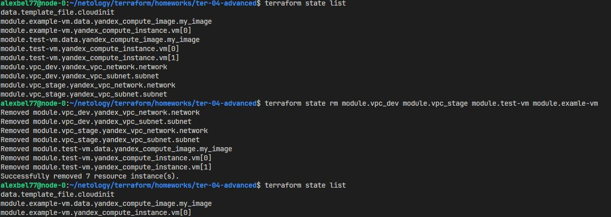
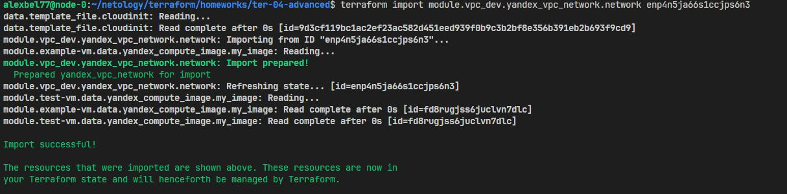
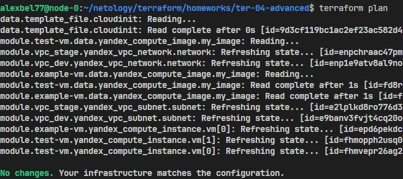

# Домашнее задание к занятию «Продвинутые методы работы с Terraform»

## Задание 1
Развернуто 2 ВМ с помощью двух вызовов одного и того же remote-модуля. Использованы **labels** для указания принадлежности к проектам **marketing** и **analytics**. Так же используется **local** переменная для подстановки публичного ключа в шаблон [cloud-init.yml]():

```hcl
locals {
  public_key = "${file("~/.ssh/yavm.pub")}"
} 
```
С помощью `data "template_file"` подставляем переменные в **cloud-init**:

```hcl
data "template_file" "cloudinit" {
  template = file("./cloud-init.yml")
    vars = {
    username           = var.ssh_username
    ssh_public_key     = local.public_key
  }
}
```

<center>
  
</center>

<center>
  
</center>

<center>
  
</center>

## Задание 2

Локальный модуль **vpc** описан в [./modules/vpc](). Документация к модулю оформлена с использование **terraform-docs** - [doc.md]():

```docker
docker run --rm --volume "$(pwd):/terraform-docs" -u $(id -u) quay.io/terraform-docs/terraform-docs:0.20.0 markdown /terraform-docs > doc.md
```

## Задание 3

<center>
  
</center>

<center>
  
</center>

<center>
  
</center>

---

## Задание 4*