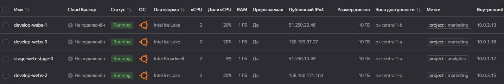
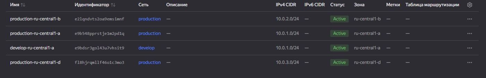
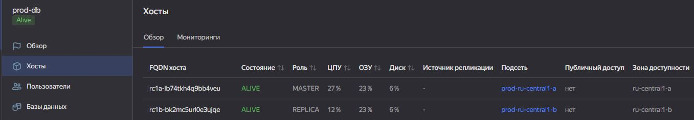
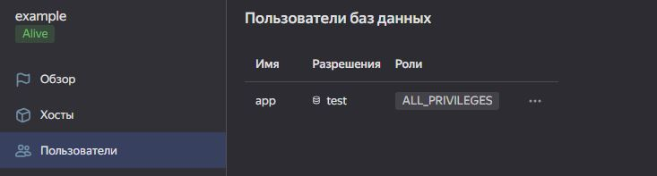
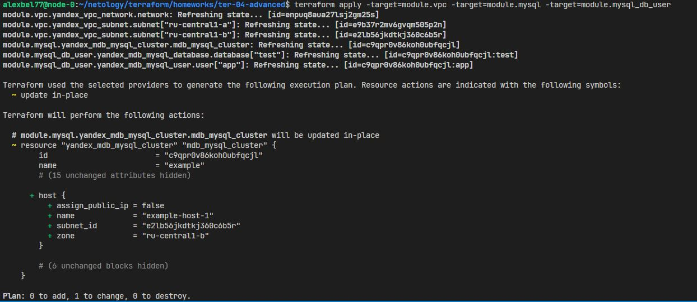
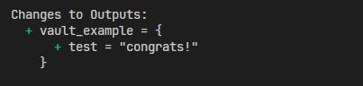
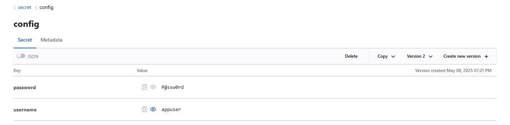

# Домашнее задание к занятию «Продвинутые методы работы с Terraform»

## Задание 1
Развернуто 2 ВМ с помощью двух вызовов одного и того же remote-модуля. Использованы **labels** для указания принадлежности к проектам **marketing** и **analytics**. Так же используется **local** переменная для подстановки публичного ключа в шаблон [cloud-init.yml]():

```hcl
locals {
  public_key = "${file("~/.ssh/yavm.pub")}"
} 
```
С помощью `data "template_file"` подставляем переменные в **cloud-init**:

```hcl
data "template_file" "cloudinit" {
  template = file("./cloud-init.yml")
    vars = {
    username           = var.ssh_username
    ssh_public_key     = local.public_key
  }
}
```

<center>
  
</center>

<center>
  
</center>

<center>
  
</center>

## Задание 2

Локальный модуль **vpc** описан в [./modules/vpc](). Документация к модулю оформлена с использование **terraform-docs** - [doc.md]():

```docker
docker run --rm --volume "$(pwd):/terraform-docs" -u $(id -u) quay.io/terraform-docs/terraform-docs:0.20.0 markdown /terraform-docs > doc.md
```

## Задание 3

<center>
  
</center>

<center>
  
</center>

<center>
  
</center>

## Задание 4*

Модуль использует **for_each** для итерации по списку объектов **subnets**(list(object)), где каждая подсеть создаётся в своей зоне с указанным **cidr**. Название каждой подсети формируется динамически.

Локальный модуль **vpc-all-zones** описан в [./modules/vpc-all-zones](). 

<center>
  
</center>

<center>
  
</center>

## Задание 5*

В [модуле для создание кластера Mysql]() динамически генерируются блоки `"host"` в зависимости от логической переменной **ha**. Если `var.ha == true,` создаются два хоста **[0, 1]**, иначе один хост **[0]**:
```hcl
dynamic "host" {
    for_each = var.ha ? [0, 1] : [0]
    content {
      name      = "${var.name}-host-${host.key}"
      zone      = var.subnets[host.key].zone
      subnet_id = var.subnets[host.key].subnet_id
```

Модуль для создания пользователей и БД находится в [./modules/mysql-db-user](). Вызов модулей в файле [mysql_cluster.tf]().

**PS:** реализацию подсмотрел у Terraform Yandex Cloud modules (terraform-yc-mysql)

<center>
  
</center>

<center>
  
</center>

<center>
  
</center>

## Задание 6*

Вызов модуля в файле [simple-bucket.tf]()

## Задание 7*

C использование ресурса `"vault_generic_secret" "example"` были переданы секреты по пути **secret/config** в json формате:

```hcl
resource "vault_generic_secret" "example" {
  path = "secret/config"

  data_json = jsonencode({
    username = "appuser"
    password = "P@ssw0rd"
  })
}
```
<center>
  
</center>

<center>
  
</center>