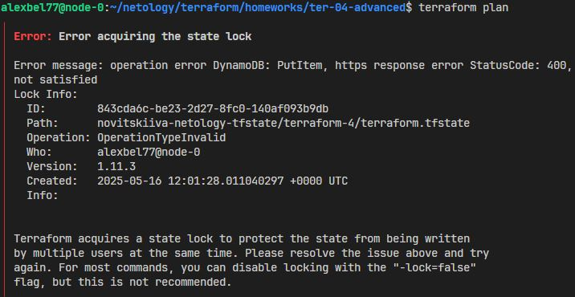
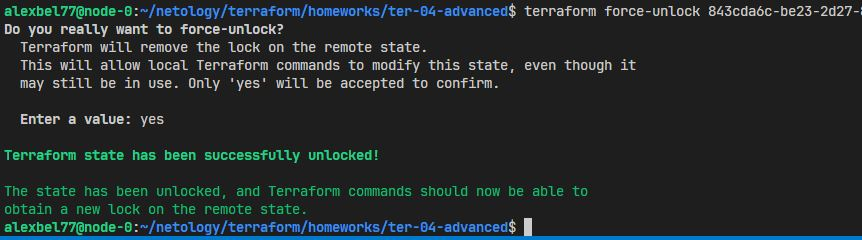
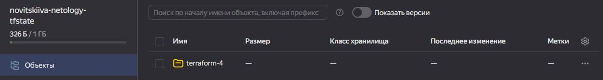
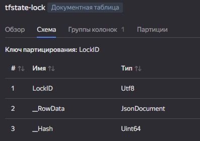
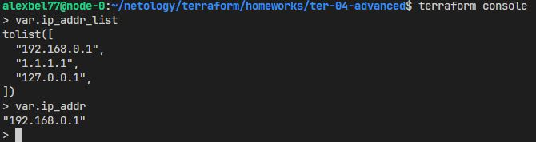
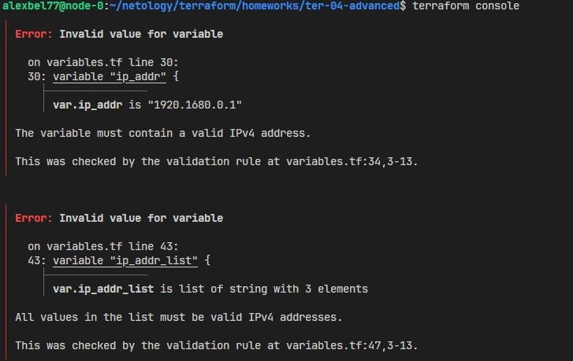

# Домашнее задание к занятию «Использование Terraform в команде»

## Задание 1

### Проверка TFLint

| Тип ошибки               | Описание                                                 | Файл/строка                                                                                                                                                                                                 |
| -------------------------------- | -------------------------------------------------------- | ------------------------------------------------------------------------------------------------------------------------------------------------------------------------------------------------------------- |
| `terraform_module_pinned_source` | Не зафиксирована версия модуля (исп. `main` вместо тега) | `main.tf:20`<br>`demonstration 1/vms/main.tf:23, 46`                                                                                                                                                          |
| `terraform_required_providers`   | Отсутствует `version` в `required_providers`             | `main.tf:64`<br>`demonstration 1/vms/main.tf:64`<br>`providers.tf:3`<br>`demonstration 1/vms/providers.tf:3`<br>`demonstration 3/providers.tf:3`<br>`simple-bucket.tf:1`<br>`demonstration 3/providers.tf:18` |
| `terraform_unused_declarations`  | Объявлена, но не используется переменная                 | `variables.tf:16` (`default_cidr`)<br>`variables.tf:21` (`vpc_name`)<br>`variables.tf:35` (`subnets`)<br>`demonstration 1/vms/variables.tf:3` (`public_key`)                                                  |

---
## Проверка Checkov

| Тип проверки и описание                           | Статус  | Ресурс                                              |
|---------------------------------------------------|---------|--------------------------------------------------------------------------------------|
| CKV_YC_12 – Ensure public IP is not assigned to database cluster | PASSED  | `mysql`                                  |
| CKV_TF_2 – Ensure Terraform module sources use a tag with a version number | PASSED  | `s3`                                                   |
| CKV_TF_1 – Ensure Terraform module sources use a commit hash   | FAILED  | `test-vm` `example-vm` `s3` `test-vm` `example-vm`  |
| CKV_TF_2 – Ensure Terraform module sources use a tag with a version number | FAILED  | `test-vm` `example-vm` `test-vm` `example-vm`|
| CKV_YC_1 – Ensure security group is assigned to database cluster | FAILED  | `mysql`                                 |
| CKV_SECRET_6 – Base64 High Entropy String         | SKIPPED | `24e7`                                                       |

## Задание 2        

Настроил YDB, S3 bucket, yandex service account, права доступа и мигрировал state проекта в S3 с блокировками.
Вынес все значения бэкенда в отдельный файл и подставил параметры через CLI при инициализации проекта.

```bash
terraform init -backend-config=env/backend.tfbackend
```

Заблокировал state, открыв terraform console в другом терминале этой же директории, и принудительно разблокировал командой:

```bash
terraform force-unlock <LockID>
```
<center>
  
</center>

<center>
  
</center>

<center>
  
</center>

<center>
  
</center>

## Задание 3  

Ссылка на PR: https://github.com/alex-bel31/ter_homeworks/pull/1

## Задание 4

Для валидации ip-адрессов используются функции:
- `regex()` - проверяет, соответствует ли значение регулярному выражению. 
- `can()` - оборачивает вызов и возвращает **true/false**, чтобы **regex** не выбрасывал ошибку, если не сработает.
- `alltrue()` - для проверки списка ip-адресов, дает гарантии, что все ip прошли проверку.

Скрины c проверками из **terraform console** ниже.


```hcl
  validation {
    condition = can(regex(
      "^((25[0-5]|2[0-4][0-9]|1?[0-9]{1,2})\\.){3}(25[0-5]|2[0-4][0-9]|1?[0-9]{1,2})$",
      var.ip_addr
    ))
    error_message = "The variable must contain a valid IPv4 address."
  }

  validation {
    condition = alltrue([for ip in var.ip_addr_list : can(regex(
      "^((25[0-5]|2[0-4][0-9]|1?[0-9]{1,2})\\.){3}(25[0-5]|2[0-4][0-9]|1?[0-9]{1,2})$",
      ip
    ))])
    error_message = "All values in the list must be valid IPv4 addresses."
  }
```

<center>
  
</center>

<center>
  
</center>

## Задание 5*

С помощью `lower()` приводим строку к нижнему регистру и сравниваем с неизмененной строкой, если они равны, значит строка не содержит символов верхнего регистра.


```hcl
  validation {
    condition = lower(var.any_string) == var.any_string
    error_message = "The string must not contain uppercase characters"
  }
```

Если значение для **Dunkan** и **Connor** не равны, значит условие задания выполняется.

```hcl
validation {
    error_message = "There can be only one MacLeod"
    condition = (var.in_the_end_there_can_be_only_one.Dunkan != var.in_the_end_there_can_be_only_one.Connor)
}
```